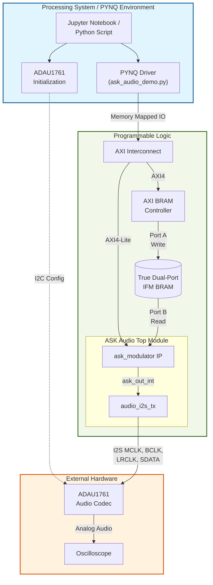
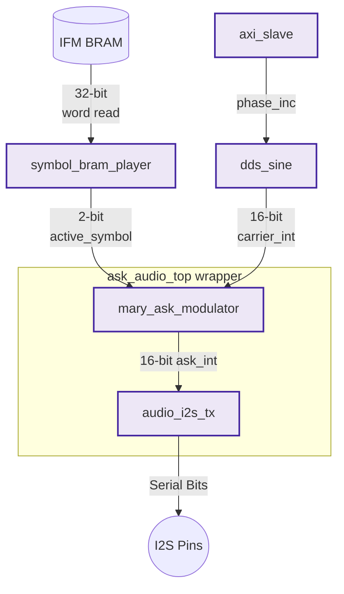
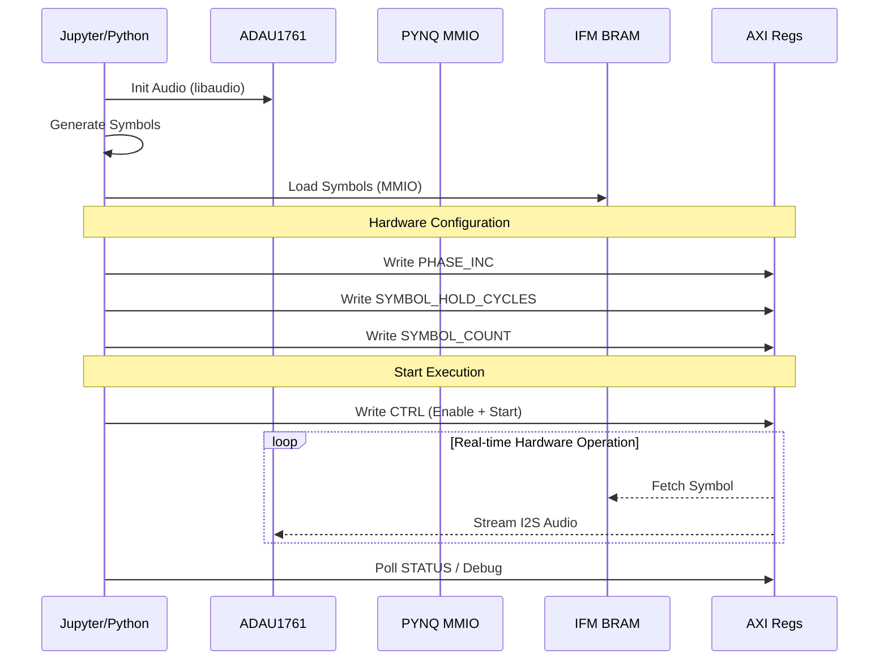

# ASK Modulation System: Comprehensive Technical Report

## 1. Introduction

This document provides a comprehensive technical analysis of the **ASK Modulation System**, a custom FPGA-based 4-ASK (Amplitude-Shift Keying) modulator designed for the Xilinx Zynq-7000/UltraScale+ SoC architectures. The system is designed using a hardware-software co-design approach: the real-time modulation and audio transmission run in hardware (Programmable Logic - PL) via SystemVerilog, while control, data generation, and monitoring are handled in software (Processing System - PS) utilizing the **PYNQ framework**.

Currently, the primary demonstration target is an oscilloscope view through the onboard ADAU1761 audio codec present on boards like the PYNQ-Z2, operating at a 48.828 kHz sample rate. 

---

## 2. System Overview & Architecture

The system operates by having the Python software environment generate baseband symbols (the Input Feature Map or IFM), load them into the FPGA's Block RAM (BRAM), and configure the IP via memory-mapped AXI4-Lite registers. Once triggered, the hardware autonomously fetches symbols, modulates a Direct Digital Synthesis (DDS) carrier wave, and streams the output directly to the I2S audio codec for observation.

### 2.1 High-Level Block Diagram

The following block diagram illustrates the boundary between the Processing System (PS) and the Programmable Logic (PL) components.



---

## 3. Hardware Implementation (RTL)

The hardware is written in SystemVerilog and packaged as a Vivado 2024.2 AXI peripheral. 

### 3.1 RTL Hierarchy and Data Flow

The data flow within the Programmable Logic starts from the BRAM, moves into the 4-ASK modulator, and is converted into the I2S protocol.



### 3.2 Core Modules Description

- **`ask_audio_top.sv`**: The highest-level wrapper for the PYNQ-Z2 demo. It instantiates the core `ask_modulator` and the `audio_i2s_tx`. It connects the modulated ASK signal, applying optional bit-shifting to prevent clipping, directly to the I2S transmitter.
- **`ask_modulator.sv`**: The AXI package top. It connects the `axi_slave` for control registers, `symbol_bram_player` to fetch baseband data, `dds_sine` for the high-frequency carrier, and `mary_ask_modulator` for amplitude scaling.
- **`symbol_bram_player.sv`**: Functions as the baseband signal generator from the hardware's perspective. It generates read addresses for the IFM BRAM, holding each 2-bit symbol for a configurable number of clock cycles (`symbol_hold_cycles`).
- **`dds_sine.sv`**: A Direct Digital Synthesizer that uses a 32-bit phase accumulator and a 1024-entry block RAM lookup table (`carrier_sine.mem`) to generate a clean digital sine wave carrier.
- **`mary_ask_modulator.sv`**: Maps the 2-bit symbols to four distinct amplitude levels (0%, ~33%, ~66%, 100%) and multiplies the amplitude scale against the 16-bit carrier sine wave.
- **`audio_i2s_tx.sv`**: Takes the parallel 16-bit digital ASK samples and serializes them into the standard I2S audio format. It derives the required `codec_mclk` (10 MHz), `codec_bclk` (3.125 MHz), and `codec_lrclk` (48.828 kHz) from the main 100 MHz PL clock.

### 3.3 Memory and Addressing (IFM BRAM)

The system uses a **True Dual-Port BRAM**. 
*   **Port A (PS Side)**: Connected to the AXI BRAM Controller. The Python script writes baseband symbols into memory.
*   **Port B (PL Side)**: Read asynchronously by the `symbol_bram_player`.
*   **Word Structure**: Each 32-bit word currently stores exactly one 4-ASK symbol in its lowest 2 bits (`word[1:0]`). Bits `[31:2]` are reserved.

### 3.4 AXI4-Lite Register Map

The hardware is controlled via the following registers defined in `axi_slave.sv`:

| Offset | Register Name | Description / Bitfields |
|---|---|---|
| `0x000` | **CTRL** | `[0]` Enable, `[1]` Soft Reset Pulse, `[2]` Start Pulse, `[3]` Loop Enable |
| `0x004` | **STATUS** | `[0]` Enabled, `[1]` Player Busy, `[2]` Player Done |
| `0x008` | **PHASE_INC** | DDS tuning word to set carrier frequency |
| `0x00C` | **SYMBOL_HOLD_CYCLES**| Number of PL clocks to hold each symbol (sets symbol rate) |
| `0x010` | **SYMBOL_COUNT** | Total number of symbols to play from BRAM |
| `0x014` | **CURRENT_SYMBOL** | Debug: Currently active 2-bit symbol |
| `0x018` | **CURRENT_SYMBOL_INDEX**| Debug: Current BRAM read address index |
| `0x01C` | **CURRENT_CARRIER** | Debug: Immediate signed 16-bit carrier sample |
| `0x020` | **CURRENT_ASK_OUT** | Debug: Immediate signed 16-bit modulated output |

---

## 4. Software & PYNQ Framework

The project relies heavily on the **PYNQ framework** to abstract complex memory-mapped IO operations into simple Python calls, eliminating the need to write custom C drivers or kernel modules.

### 4.1 Software Execution Flow

The software lifecycle for a demonstration follows a specific state machine:



### 4.2 The Python Driver (`ask_audio_demo.py`)

The object-oriented `AskAudioDemo` class encapsulates hardware interaction:
1.  **Overlay Loading**: `self.overlay = Overlay(bitfile)` seamlessly programs the FPGA PL with `ask_audio.bit`.
2.  **IP Discovery**: The script dynamically discovers the base addresses of the custom IP (`ask_modulator`) and the AXI BRAM Controller from the `.hwh` hardware handoff file.
3.  **Memory Management**: `pynq.MMIO` is utilized for absolute physical memory addressing.
    - `self.ask_mmio.write(offset, value)` manipulates the AXI configuration registers.
    - `self.ifm_mmio.write(index * 4, symbol)` loads data directly into the BRAM physical address space.

### 4.3 ADAU1761 Codec Initialization

Because audio functionality on the PYNQ-Z2 requires the initialization of the onboard ADAU1761 audio codec, the script `adau1761_init.py` utilizes `cffi` to hook into PYNQ's pre-compiled C library (`libaudio.so`). It sends the complex I2C sequence required to configure the codec's Phase-Locked Loop (PLL) and internal routing paths, preparing it to receive the custom I2S data stream generated by the PL.

---

## 5. System Timing and Equations

The software driver dynamically computes the exact hardware registers needed to achieve user-defined real-world frequencies.

1.  **DDS Carrier Tuning (`PHASE_INC`)**:
    The hardware DDS uses a 32-bit phase accumulator. The phase increment determines the step size per clock cycle, determining the output frequency.
    ```text
    PHASE_INC = Round( (Carrier_Frequency_Hz / PL_Clock_Hz) * 2^32 )
    ```
    *Example (PYNQ Demo)*: For a 4 kHz carrier on a 100 MHz clock, `PHASE_INC = 171799`.

2.  **Symbol Rate Tuning (`SYMBOL_HOLD_CYCLES`)**:
    Controls the baud rate of the communication system.
    ```text
    SYMBOL_HOLD_CYCLES = Round( PL_Clock_Hz / Symbol_Rate_Hz )
    ```
    *Example (PYNQ Demo)*: For 100 symbols per second on a 100 MHz clock, `SYMBOL_HOLD_CYCLES = 1,000,000`.

## 6. Conclusion

The ASK Modulation System successfully leverages Xilinx SoC capabilities by combining tight, deterministically timed RTL (SystemVerilog) with flexible, high-level control software (Python via PYNQ). The AXI4-Lite architecture ensures standard integration into Vivado Block Designs, while the dual-port IFM BRAM architecture cleanly decouples the software symbol generation from the real-time hardware transmission requirements.
