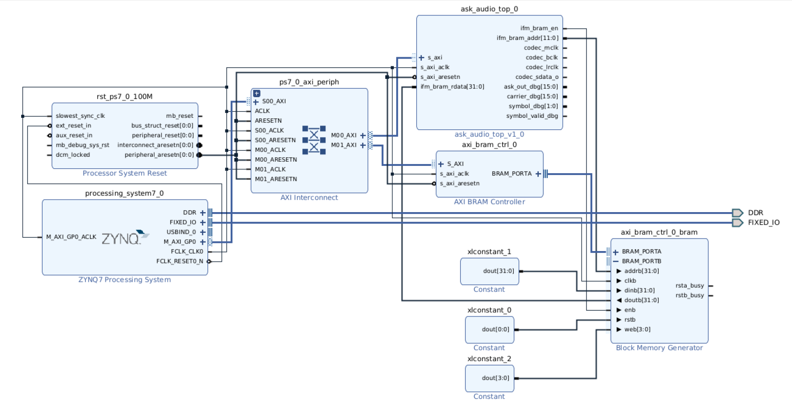

# PYNQ-Z2 ASK Audio Vivado 2024.2 Bring-Up

This guide packages the current RTL as a Vivado IP and builds a PYNQ-Z2 block
design for the onboard ADAU1761 audio-codec oscilloscope demo.



The first hardware demo uses:

```text
ask_audio_top
  -> ask_modulator
  -> audio_i2s_tx
  -> PYNQ-Z2 ADAU1761 audio codec
  -> 3.5 mm audio output / oscilloscope
```

The software flow loads baseband symbols into IFM BRAM, configures AXI
registers, starts playback, and initializes the codec.

## 1. Prerequisites

Use:

```text
Vivado 2024.2
PYNQ-Z2 board files installed
PYNQ-Z2 master/base constraints available
Repository root: /home/hieu/ASK_modulation
```

Generated or checked-in files needed by Vivado:

```text
hdl/ask_audio_top.sv
hdl/audio_i2s_tx.sv
hdl/ask_modulator.sv
hdl/axi_slave.sv
hdl/symbol_bram_player.sv
hdl/dds_sine.sv
hdl/mary_ask_modulator.sv
sim/tb/carrier_sine.mem
constraints/pynq_z2_audio.xdc
```

Recommended first demo settings:

```text
PL clock           = 100 MHz
MCLK               = 10 MHz
BCLK               = 3.125 MHz
LRCLK/sample rate  = 48.828125 kHz
Carrier            = 4 kHz
Symbol rate        = 100 sym/s
IFM BRAM depth     = 4096 x 32
```

## 2. Create the Vivado Project

1. Open Vivado 2024.2.
2. Select **Create Project**.
3. Project name example:

```text
ask_audio_pynq_z2
```

4. Choose an RTL project.
5. Add the RTL sources listed above.
6. Add `sim/tb/carrier_sine.mem` as a memory initialization/design source.
7. Add `constraints/pynq_z2_audio.xdc` as a constraints file.
8. Select the PYNQ-Z2 board in the board selection page.
9. Finish project creation.

If the PYNQ-Z2 board is not listed, install the board files first. Do not select
a generic part unless you also have a complete PYNQ-Z2 XDC ready.

## 3. Confirm RTL Before Packaging

In **Sources**, confirm:

```text
ask_audio_top
  ask_modulator
    axi_slave
    symbol_bram_player
    dds_sine
    mary_ask_modulator
  audio_i2s_tx
```

Set `ask_audio_top` as the top module temporarily and run **RTL Analysis**.
Fix any missing source or memory path before packaging.

Important parameter:

```text
SINE_MEM_FILE = "carrier_sine.mem"
```

For packaging, keep the `.mem` file inside the IP source tree or add it as an
IP file group source so Vivado can find it during synthesis.

## 4. Package `ask_audio_top` as IP

1. Open **Tools > Create and Package New IP**.
2. Select **Package your current project**.
3. Choose an IP repository location, for example:

```text
/home/hieu/ASK_modulation/vivado/ip_repo
```

4. Use these identity fields:

```text
Vendor:     user.org
Library:    user
Name:       ask_audio_top
Version:    1.0
Display:    ASK Audio Top
```

5. In **IP Packager**, open **File Groups**.
6. Ensure these files are included in synthesis:

```text
hdl/ask_audio_top.sv
hdl/audio_i2s_tx.sv
hdl/ask_modulator.sv
hdl/axi_slave.sv
hdl/symbol_bram_player.sv
hdl/dds_sine.sv
hdl/mary_ask_modulator.sv
sim/tb/carrier_sine.mem
```

7. Confirm `carrier_sine.mem` is not accidentally marked as simulation-only.
8. Open **Customization Parameters** and expose these as configurable
   parameters if Vivado does not infer them automatically:

```text
PHASE_W
LUT_ADDR_W
AMP_W
MULT_W
AXI_ADDR_W
IFM_ADDR_W
AUDIO_SHIFT
SINE_MEM_FILE
DEFAULT_PHASE_INC
DEFAULT_SYMBOL_HOLD_CYCLES
DEFAULT_SYMBOL_COUNT
```

Recommended defaults for this demo:

```text
PHASE_W                    = 32
LUT_ADDR_W                 = 10
AMP_W                      = 16
MULT_W                     = 8
AXI_ADDR_W                 = 12
IFM_ADDR_W                 = 12
AUDIO_SHIFT                = 2
SINE_MEM_FILE              = carrier_sine.mem
DEFAULT_PHASE_INC          = 171799
DEFAULT_SYMBOL_HOLD_CYCLES = 1000000
DEFAULT_SYMBOL_COUNT       = 4096
```

9. Open **Ports and Interfaces**.
10. Map the AXI4-Lite slave interface manually if Vivado does not infer it:

```text
s_axi_aclk      -> clock
s_axi_aresetn   -> reset, active low
s_axi_awaddr    -> S_AXI AWADDR
s_axi_awprot    -> S_AXI AWPROT
s_axi_awvalid   -> S_AXI AWVALID
s_axi_awready   -> S_AXI AWREADY
s_axi_wdata     -> S_AXI WDATA
s_axi_wstrb     -> S_AXI WSTRB
s_axi_wvalid    -> S_AXI WVALID
s_axi_wready    -> S_AXI WREADY
s_axi_bresp     -> S_AXI BRESP
s_axi_bvalid    -> S_AXI BVALID
s_axi_bready    -> S_AXI BREADY
s_axi_araddr    -> S_AXI ARADDR
s_axi_arprot    -> S_AXI ARPROT
s_axi_arvalid   -> S_AXI ARVALID
s_axi_arready   -> S_AXI ARREADY
s_axi_rdata     -> S_AXI RDATA
s_axi_rresp     -> S_AXI RRESP
s_axi_rvalid    -> S_AXI RVALID
s_axi_rready    -> S_AXI RREADY
```

11. Keep the IFM BRAM read pins as regular ports:

```text
ifm_bram_rdata[31:0]
ifm_bram_en
ifm_bram_addr[11:0]
```

12. Keep the ADAU1761 pins as external regular ports:

```text
codec_mclk
codec_bclk
codec_lrclk
codec_sdata_o
```

13. Keep debug pins as optional external regular ports or leave them internal
    if not needed:

```text
ask_out_dbg[15:0]
carrier_dbg[15:0]
symbol_dbg[1:0]
symbol_valid_dbg
```

14. Open **Review and Package**.
15. Click **Package IP**.

## 5. Add the IP Repository

1. Create or open the final block-design project.
2. Open **Settings > IP > Repository**.
3. Add:

```text
/home/hieu/ASK_modulation/vivado/ip_repo
```

4. Click **Refresh All**.
5. Confirm `ASK Audio Top` appears in the IP catalog.

## 6. Build the Block Design

Create a block design named:

```text
ask_audio_bd
```

Add IP blocks:

```text
ZYNQ7 Processing System
AXI SmartConnect or AXI Interconnect
Processor System Reset
ASK Audio Top
AXI BRAM Controller
Block Memory Generator
```

Run **Run Block Automation** for the Zynq PS and select the PYNQ-Z2 preset.

Configure PS:

```text
FCLK_CLK0 = 100 MHz
M_AXI_GP0 enabled
```

Connect clocks/resets:

```text
FCLK_CLK0          -> ask_audio_top/s_axi_aclk
FCLK_CLK0          -> AXI SmartConnect aclk
FCLK_CLK0          -> AXI BRAM Controller s_axi_aclk
FCLK_CLK0          -> Processor System Reset slowest_sync_clk
peripheral_aresetn -> ask_audio_top/s_axi_aresetn
peripheral_aresetn -> AXI BRAM Controller s_axi_aresetn
```

Connect AXI:

```text
PS M_AXI_GP0 -> SmartConnect S00_AXI
SmartConnect M00_AXI -> ask_audio_top S_AXI
SmartConnect M01_AXI -> AXI BRAM Controller S_AXI
```

## 7. Configure IFM BRAM

Configure **Block Memory Generator**:

```text
Memory type: True Dual Port RAM
Write width: 32
Read width: 32
Depth: 4096
Port A: connected to AXI BRAM Controller
Port B: connected to ask_audio_top
Read latency: 1 cycle
```

Connect Port A to AXI BRAM Controller normally through Vivado automation.

Connect Port B manually:

```text
ask_audio_top/ifm_bram_addr[11:0] -> BRAM addrb[11:0]
ask_audio_top/ifm_bram_en         -> BRAM enb
BRAM doutb[31:0]                  -> ask_audio_top/ifm_bram_rdata[31:0]
FCLK_CLK0                         -> BRAM clkb
peripheral_aresetn or constant 1  -> BRAM rstb, depending on BRAM config
```

Tie unused Port B write controls inactive:

```text
web   = 0
dinb  = 0
```

The RTL expects one symbol per 32-bit word:

```text
word[1:0]  = 4-ASK symbol
word[31:2] = reserved
```

## 8. Connect Audio Codec Pins

Make these `ask_audio_top` ports external:

```text
codec_mclk
codec_bclk
codec_lrclk
codec_sdata_o
```

Apply:

```text
constraints/pynq_z2_audio.xdc
```

Current assignments:

```text
codec_mclk    -> U5
codec_bclk    -> R18
codec_lrclk   -> T17
codec_sdata_o -> G18
```

These names must match the top-level external port names generated by the block
design wrapper. If Vivado renames them, either rename the external ports or edit
the XDC accordingly.

## 9. Codec I2C Requirement

The ADAU1761 must be configured over I2C before audio appears at the jack.

Preferred first implementation:

```text
Use the PYNQ image's existing codec I2C path and pynq/libaudio.so.
```

The helper `pynq/adau1761_init.py` calls:

```text
config_audio_pll(iic_index=1)
config_audio_codec(iic_index=1)
```

If the codec I2C bus is not available in Linux, add one of these to the block
design:

```text
PS I2C over EMIO to the ADAU1761 I2C pins
```

or:

```text
AXI IIC connected to the ADAU1761 I2C pins
```

If routing I2C through PL, use the commented I2C pin constraints in
`constraints/pynq_z2_audio.xdc`:

```text
IIC_1_scl_io -> U9
IIC_1_sda_io -> T9
```

## 10. Address Map

Assign stable addresses before exporting the hardware.

Recommended layout:

```text
ask_audio_top/S_AXI       0x43C0_0000, range 64K
axi_bram_ctrl_0/S_AXI     0x4000_0000, range 16K for 4096 x 32
```

The Python driver can auto-discover IP names from the `.hwh`, but stable names
make bring-up easier:

```text
ask_audio_top_0
axi_bram_ctrl_0
```

ASK AXI register map:

```text
0x000 CTRL                 bit0 enable, bit1 soft_reset, bit2 start, bit3 loop_enable
0x004 STATUS               bit0 enabled, bit1 busy, bit2 done
0x008 PHASE_INC
0x00C SYMBOL_HOLD_CYCLES
0x010 SYMBOL_COUNT
0x014 CURRENT_SYMBOL
0x018 CURRENT_SYMBOL_INDEX
0x01C CURRENT_CARRIER
0x020 CURRENT_ASK_OUT
```

## 11. Validate and Generate Bitstream

In Vivado:

1. Click **Validate Design**.
2. Fix any clock, reset, or address map warnings.
3. Right-click the block design and select **Create HDL Wrapper**.
4. Let Vivado manage the wrapper.
5. Run **Synthesis**.
6. Run **Implementation**.
7. Check timing.
8. Generate bitstream.

Expected output files:

```text
ask_audio.bit
ask_audio.hwh
```

The `.hwh` file is required by PYNQ so Python can discover the MMIO address map.

## 12. Copy Files to PYNQ-Z2

Copy these files into one directory on the board:

```text
ask_audio.bit
ask_audio.hwh
pynq/ask_audio_demo.py
pynq/adau1761_init.py
```

Optional demo config:

```text
sim/out/pynq_demo_config.json
```

## 13. Generate Demo Symbols

On the host:

```bash
cd /home/hieu/ASK_modulation
python3 sw/ask_demo_data.py \
  --symbols 4096 \
  --carrier-hz 4000 \
  --symbol-rate 100 \
  --mode pattern \
  --pattern 0 1 3 2 \
  --mem sim/tb/baseband_symbols.mem \
  --csv sim/out/pynq_demo_symbols.csv \
  --json sim/out/pynq_demo_config.json
```

Expected values:

```text
phase_inc=171799
symbol_hold_cycles=1000000
```

## 14. Run the PYNQ Demo

On the PYNQ-Z2:

```bash
python3 ask_audio_demo.py --bit ask_audio.bit
```

With generated config:

```bash
python3 ask_audio_demo.py --bit ask_audio.bit --config-json pynq_demo_config.json
```

For a constant full-amplitude test tone:

```bash
python3 ask_audio_demo.py --bit ask_audio.bit --mode constant --constant-symbol 2 --carrier-hz 4000 --symbol-rate 100
```

For the repeating 4-level ASK envelope:

```bash
python3 ask_audio_demo.py --bit ask_audio.bit --mode pattern --pattern 0 1 3 2 --carrier-hz 4000 --symbol-rate 100
```

## 15. Oscilloscope Bring-Up

1. Connect the oscilloscope probe to the PYNQ-Z2 headphone output.
2. Use AC coupling first.
3. Start with:

```text
Time base: 1 ms/div to 5 ms/div
Vertical: adjust after confirming codec output level
Expected carrier: 4 kHz
Expected envelope: 100 symbols/s
```

4. First test constant symbol `2` (`2'b10`) for a steady carrier.
5. Then test pattern `0 1 3 2` for visible amplitude changes.

## 16. Debug Checklist

If no waveform appears:

1. Confirm Python can load the overlay and find:

```text
ask_audio_top_0
axi_bram_ctrl_0
```

2. Confirm `pynq/adau1761_init.py` does not report codec init failure.
3. Read debug registers from Python:

```python
demo.status()
demo.read_debug()
```

4. Add ILA probes:

```text
ask_out_dbg
symbol_dbg
symbol_valid_dbg
codec_mclk
codec_bclk
codec_lrclk
codec_sdata_o
ifm_bram_addr
ifm_bram_rdata
```

5. Confirm `symbol_valid_dbg` goes high after `CTRL start`.
6. Confirm `codec_lrclk` is approximately `48.828 kHz`.
7. Confirm `codec_sdata_o` toggles when the ASK sample is nonzero.

If symbols do not change:

```text
Check AXI BRAM Controller base address.
Check IFM BRAM depth/range.
Check ifm_bram_addr increments.
Check SYMBOL_COUNT and SYMBOL_HOLD_CYCLES registers.
```

If codec init fails:

```text
Confirm codec I2C is visible to Linux.
Confirm the PYNQ image includes pynq.lib.audio and libaudio.so.
Confirm iic_index=1 is correct for the image.
```

## 17. Current Limitations

This first demo is audio-band ASK through the onboard codec. It is not a
high-speed RF/DAC demo.

OFM BRAM/capture is intentionally not included.

The direct ADAU1761 I2C fallback in `pynq/adau1761_init.py` is intentionally not
filled with an unverified register sequence. The validated first path is PYNQ
`libaudio.so`.
